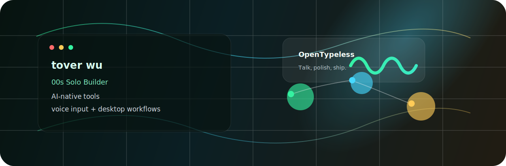

  

<h1 align="center">Hi, I'm tover wu</h1>

  <strong>00s Solo Builder</strong> at ByteDance, building AI-native tools that make everyday computer work feel lighter.

  
  
  

---

### What I'm building

I like turning rough AI ideas into small, useful products. Recently, most of my attention has been on voice-first productivity, desktop workflows, and tools that help people move from thought to finished text faster.

<table>
  <tr>
    <td width="50%">
      <h3><a href="https://github.com/tover0314-w/opentypeless">OpenTypeless</a></h3>
      
Type with your voice anywhere. Talk, record, polish, done.

      

        
        
        
      

    </td>
    <td width="50%">
      <h3><a href="https://github.com/tover0314-w/Transformer_coding_excise">Transformer Coding Exercise</a></h3>
      
Hands-on notes and code for self-attention, encoder, and decoder fundamentals.

      

        
        
      

    </td>
  </tr>
  <tr>
    <td width="50%">
      <h3><a href="https://github.com/tover0314-w/nextjs-signin">Next.js Signin</a></h3>
      
A Next.js starter that explores a ready-to-use sign-in flow.

      

        
        
      

    </td>
    <td width="50%">
      <h3><a href="https://github.com/tover0314-w/vapi-ai-teaching-platform">AI Teaching Platform</a></h3>
      
A teaching platform experiment with Next.js, Supabase, Clerk, and Vapi AI.

      

        
        
        
      

    </td>
  </tr>
</table>

### Toolbox

  

### Current focus

- Building practical AI products from zero to one
- Making voice input feel natural in real desktop workflows
- Shipping with TypeScript, Next.js, Tauri, Python, and LLM APIs
- Learning by making small prototypes, then polishing the ones that stick

### GitHub snapshot

  
  

  

---

  <strong>Talk more. Type less. Build faster.</strong>

